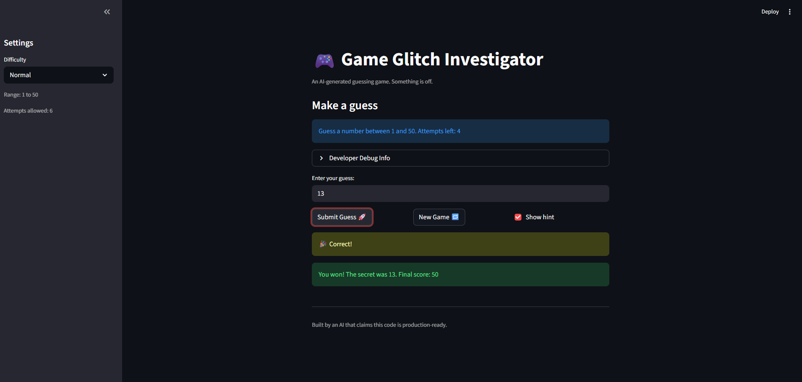

# 🎮 Game Glitch Investigator: The Impossible Guesser

## 🚨 The Situation

You asked an AI to build a simple "Number Guessing Game" using Streamlit.
It wrote the code, ran away, and now the game is unplayable. 

- You can't win.
- The hints lie to you.
- The secret number seems to have commitment issues.

## 🛠️ Setup

1. Install dependencies: `pip install -r requirements.txt`
2. Run the broken app: `python -m streamlit run app.py`

## 🕵️‍♂️ Your Mission

1. **Play the game.** Open the "Developer Debug Info" tab in the app to see the secret number. Try to win.
2. **Find the State Bug.** Why does the secret number change every time you click "Submit"? Ask ChatGPT: *"How do I keep a variable from resetting in Streamlit when I click a button?"*
3. **Fix the Logic.** The hints ("Higher/Lower") are wrong. Fix them.
4. **Refactor & Test.** - Move the logic into `logic_utils.py`.
   - Run `pytest` in your terminal.
   - Keep fixing until all tests pass!

## 📝 Document Your Experience

- [ ] Describe the game's purpose: The game is guessing game where users can choose between  easy, normal, amd hard difficulty modes, each of which possessing increasingly challenging ranges to guess from as well as decreasing guess attempts.
- [ ] Detail which bugs you found: Bugs I found included (1) hints were inverted (i.e., printed too high when too low and vice versa). (2) number of attempts per difficulty were misassigned. (3) Some subheader text(s) didn't update the information displayed when selecting a specific mode. (4) The game's "status tracking" functionality worked incorrectly
- [ ] Explain what fixes you applied: (1) Simply changed some print statements. (2) Changed the numbers within the attempt_limit_map. (3) Used f-strings instead of just print statements. (4) Updated the following "st.session_state.status = 'playing'"

## 📸 Demo

- [ ] [Insert a screenshot of your fixed, winning game here]

## 🚀 Stretch Features

- [ ] [If you choose to complete Challenge 4, insert a screenshot of your Enhanced Game UI here]
